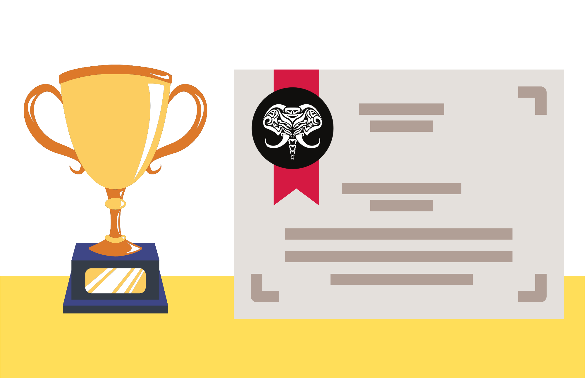

## **RECONOCIMIENTOS Y CERTIFICACIONES**

Este repositorio contiene todos los reconocimientos y certificados obtenidos durante mi carrera profesional.

## **Certificados electrónicos:**

🏆 [Developing Android Applications with Kotlin: Getting Started](https://app.pluralsight.com/achievements/share/11ac7f9d-8616-4d63-9a34-a0342b2c6382) 
🏆 [Developing Android Applications with Kotlin: The Big Picture](https://app.pluralsight.com/achievements/share/a0cdb21e-372a-42b7-86d4-9e364edc13af) 
🏆 [Testing and Debugging with Android Studio and Gradle](https://app.pluralsight.com/achievements/share/7bd3fa11-1bd0-4d10-9b6e-55208c26051d) 
🏆 [Customizing Styles and Themes with Resources](https://app.pluralsight.com/achievements/share/76230591-75f4-4ce2-b1f3-8167d9a4208c) 
🏆 [Creating High-quality UX with AndroidX](https://app.pluralsight.com/achievements/share/b44bbb74-e409-4ead-a635-5921f4a84ca9) 
🏆 [Managing LifeCycle and ViewModel Data](https://app.pluralsight.com/achievements/share/9711aff1-c2c8-43d4-af73-eefe54ac2794) 
🏆 [Customizing UI Settings Using the AndroidX Preference Library](https://app.pluralsight.com/achievements/share/eac27593-9b8b-46f8-9373-2b4617785ed2) 
🏆 [Managing and Binding Data Using the Paging Library](https://app.pluralsight.com/achievements/share/42c50f57-623f-4e45-a248-e74d89b030a6) 
🏆 [Creating a Database with SQLite, DAO, and Room](https://app.pluralsight.com/achievements/share/1e883f5c-c335-4ee0-b05b-9a553c9f1bff) 
🏆 [Enhancing UX with Notifications and App Widgets](https://app.pluralsight.com/achievements/share/ed7f4ece-e8a6-4ebb-ac8f-cde29ccfcf95) 
🏆 [Developing Android Applications with Kotlin: Custom Views Playbook](https://app.pluralsight.com/achievements/share/44fefd2b-8c25-4b07-9a49-f450b1d56daa) 
🏆 [Creating Accessibility-friendly Applications](https://app.pluralsight.com/achievements/share/13378345-282b-4a20-906d-eacd74580912) 
🏆 [GitHub Fundamentals](https://app.pluralsight.com/achievements/share/1e3287a7-fdd0-4e0e-9c80-2fe287502b1d) 
🏆 [GitHub Pull Requests from Start to Finish](https://app.pluralsight.com/achievements/share/dbaad79d-c7e1-40ec-ab9e-3f4a9fb3ce6f) 
🏆 [Supercharging Your GitHub Workflow](https://app.pluralsight.com/achievements/share/8cab5d7c-0a06-4d71-aaf6-03db8e72bb4d) 
🏆 [Getting Started with GitHub Actions](https://app.pluralsight.com/achievements/share/c08ec8cc-29fe-4112-8c38-b73fd0923472) 
🏆 [Building Custom GitHub Actions](https://app.pluralsight.com/achievements/share/00af4c37-4055-404e-a5d9-8f49463aa605) 
🏆 [Open Source Your GitHub Project](https://app.pluralsight.com/achievements/share/7d4945af-d256-41d0-8c02-c3ff2de1bb09) 
🏆 [Getting Started with GitHub Desktop](https://app.pluralsight.com/achievements/share/d74f6681-e349-40e0-9576-aecbdeecf735) 
🏆 [Securing Your GitHub Project](https://app.pluralsight.com/achievements/share/4a42f746-16b4-4c53-ad8e-b9ae35eefb7b) 
🏆 [GitHub Foundations: Adopting an InnerSource Culture with GitHub](https://app.pluralsight.com/achievements/share/e7faacab-2262-4179-aa45-79f475384d74) 
🏆 [Contributing to an Open Source Project on GitHub](https://app.pluralsight.com/achievements/share/7c36f35a-bc7d-4760-b935-7a3c39bec798) 
🏆 [Adapting CLEAN Architecture in Android Apps](https://app.pluralsight.com/achievements/share/fb51eec7-fe69-4ff1-8c1b-d612f8497329) 
🏆 [Gradle Fundamentals](https://app.pluralsight.com/achievements/share/1852d327-4821-411f-9655-b3e36b615b27) 
🏆 [Getting Started with Jenkins](https://app.pluralsight.com/achievements/share/635494f5-838c-4aa2-ad0e-487695e9fa21) 
🏆 [Getting Started in the Lab Environment](https://app.pluralsight.com/achievements/share/a94c0152-763d-4601-a58c-b461eb51ae67) 
🏆 [Install and Configure Jenkins - Part 1](https://app.pluralsight.com/achievements/share/c53d868d-486f-4894-b7e5-ae32180adbc4) 
🏆 [Using and Managing Jenkins Plugins](https://app.pluralsight.com/achievements/share/42761277-f4e0-4eb5-9ad4-f7ae1e3f961b) 
🏆 [Using Declarative Jenkins Pipelines](https://app.pluralsight.com/achievements/share/ee4bd44f-236b-4c18-a4cc-caca37251de8) 
🏆 [Building and Using a Multi-node Jenkins Farm](https://app.pluralsight.com/achievements/share/16f4d863-bf2a-4fa7-9836-5f8f50e693ea) 
🏆 [Running Jenkins in Docker](https://app.pluralsight.com/achievements/share/d48b3406-87ad-4ec2-8ba3-aa322a2ec1d3) 
🏆 [Creational Design Patterns in Kotlin](https://app.pluralsight.com/achievements/share/a7b14b88-7848-4e7c-9447-0e3c7bc5775e) 
🏆 [Running Jenkins in Kubernetes](https://app.pluralsight.com/achievements/share/e4fc32ba-15b9-4571-b7f0-e1a0de31cdff) 
🏆 [Kotlin: The Big Picture](https://app.pluralsight.com/achievements/share/e24ddd91-0825-473a-ad1f-936a3c95a66f) 
🏆 [Android FirebaseUI Authentication with Kotlin](https://app.pluralsight.com/achievements/share/3243c08a-9404-459c-9a9b-de8fa9486f91) 
🏆 [Flutter 2: The Big Picture](https://app.pluralsight.com/achievements/share/d155b63d-bd8a-4a96-9005-55c7d18fe363) 
🏆 [Flutter 2: Getting Started](https://app.pluralsight.com/achievements/share/a3735b59-6ac0-4faf-974e-32a4a62d5210) 
🏆 [Creating Layouts with Flutter 2](https://app.pluralsight.com/achievements/share/cb4462ce-1af8-485f-9f6a-531c3929b0bb) 
🏆 [Creating a Connected App with Flutter 1](https://app.pluralsight.com/achievements/share/e87c3432-1a15-401b-97b5-b9a82b28fc09) 
🏆 [Managing State in Flutter 1](https://app.pluralsight.com/achievements/share/01049d37-0fcb-4499-a141-a45c5e3292c4) 
🏆 [Persisting Data Locally with Flutter 2](https://app.pluralsight.com/achievements/share/c8d58d8d-3015-4854-92f1-cef29108d43b) 
🏆 [Creating Animations with Flutter 1](https://app.pluralsight.com/achievements/share/6bc39b80-4baf-426b-82bf-119ff56e7e4d) 
🏆 [Creating Forms with Flutter 1](https://app.pluralsight.com/achievements/share/60ae2331-f055-4e42-8b5a-7ce897ddd3db) 
